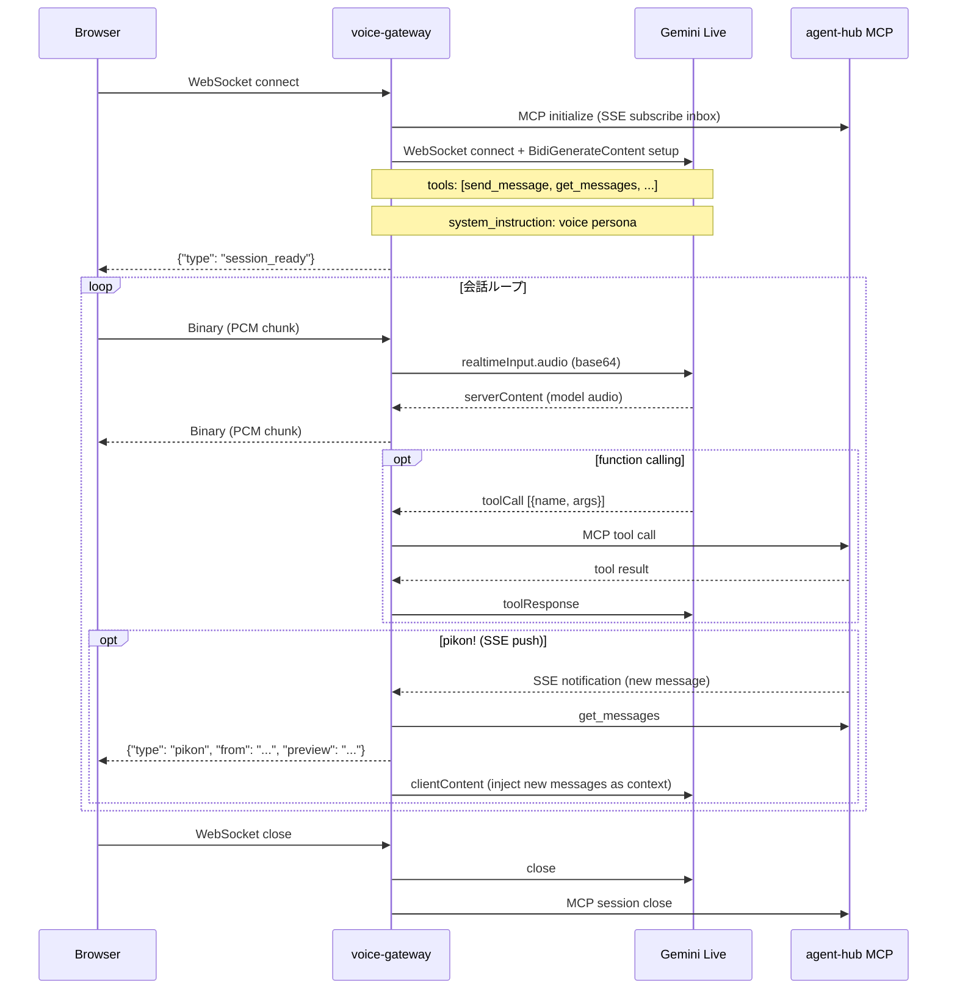

# voice-gateway 設計

> **対応 issue**: [#223](https://github.com/kishibashi3/agent-hub/issues/223)
> **作成**: @agent-hub-impl (2026-06-04)
> **ステータス**: In Progress (実装中 — [`kishibashi3/agent-hub-voice`](https://github.com/kishibashi3/agent-hub-voice))
> **実装 repo**: https://github.com/kishibashi3/agent-hub-voice

---

## 1. 概要

Gemini Live API を使ったリアルタイム音声インターフェースを agent-hub に統合するための新サービス **voice-gateway** の設計。

スマホブラウザから音声で ecosystem を操作できる「声で話す agent-hub クライアント」として機能する。
LLM として Gemini が agent-hub の MCP ツールを function として呼び出し、音声で `send_message` / `get_messages` 等を実行する。

### 1.1 全体アーキテクチャ

```
┌───────────────────────────────────────────────────────────────┐
│                 スマホブラウザ (iOS/Android)                     │
│                                                               │
│  getUserMedia() → PCM audio → WebSocket → Pi5               │
│  Web Audio API ← PCM audio ← WebSocket ← Pi5               │
│  (pikon!: AudioContext.createOscillator)                      │
└──────────────────────────┬────────────────────────────────────┘
                           │ WebSocket (ws:// LAN / wss:// 外部)
                           │ port 8765
┌──────────────────────────▼────────────────────────────────────┐
│              voice-gateway (Python, Pi5, port 8765)           │
│                                                               │
│  ┌─────────────────┐     ┌─────────────────────────────────┐ │
│  │  Browser WS      │     │  Gemini Live WebSocket client   │ │
│  │  Handler         │◄───►│  (bidirectional audio stream)   │ │
│  │                  │     │  model: gemini-2.0-flash-live   │ │
│  └────────┬─────────┘     └──────────────┬──────────────────┘ │
│           │ pikon!                        │ toolCall           │
│  ┌────────▼─────────────────────────────▼──────────────────┐ │
│  │            agent-hub MCP Client                          │ │
│  │  (SSE push subscribe + tool call dispatcher)            │ │
│  └─────────────────────────────────────────────────────────┘ │
└──────────────────────────┬────────────────────────────────────┘
             ┌─────────────┴──────────────┐
             │                            │
             ▼                            ▼
┌────────────────────┐     ┌────────────────────────────────────┐
│  agent-hub server  │     │  Gemini Live API (Google Cloud)    │
│  localhost:3000    │     │  wss://generativelanguage.         │
│  /mcp              │     │  googleapis.com/ws/...             │
└────────────────────┘     └────────────────────────────────────┘
```

### 1.2 設計方針

| 項目 | 採択 | 理由 |
|---|---|---|
| 実装言語 | **Python + asyncio** | Gemini Live SDK が Python ネイティブ / Pi5 軽量運用 |
| ブラウザ通信 | **WebSocket** | getUserMedia → PCM の双方向リアルタイム転送 |
| VAD | **Gemini Live built-in server-side VAD** | クライアント実装不要、遅延最小 |
| MCP 接続 | **httpx (HTTP 直接)** | agent-hub MCP HTTP endpoint に直接 POST |
| 音声フォーマット | **PCM 16-bit LE、16kHz、mono** | Gemini Live 要求フォーマット |
| Gemini モデル | **gemini-2.0-flash-live-001** | 低遅延 / 安定版 |
| pikon! 音源 | **Web Audio API (browser 側生成)** | gateway からの control JSON で trigger |
| **同時接続数** | **1 セッション (single session)** | agent-hub の single PAT mode では複数接続しても全員が同一 identity になるため |

---

## 2. docker-compose サービス定義

既存 `docker-compose.yml` に以下の `voice-gateway` サービスを追加:

```yaml
  # ---- voice-gateway (= @ope-ultp1635 委任、 issue #223) ----
  # Gemini Live を使ったスマホ音声インターフェース。
  # browser WebSocket ↔ Pi5 ↔ Gemini Live の双方向音声中継。
  # agent-hub MCP ツール (send_message / get_messages 等) を
  # Gemini Live の function calling として expose。
  # 実装: github.com/kishibashi3/agent-hub-voice (独立 repo)
  voice-gateway:
    image: ghcr.io/kishibashi3/agent-hub-voice:latest
    container_name: voice-gateway
    restart: unless-stopped
    ports:
      # browser WebSocket + HTTP static (LAN 内は ws://、外部公開は nginx TLS termination 推奨)
      - "8765:8765"
    environment:
      # Gemini Live API 認証
      GEMINI_API_KEY: ${GEMINI_API_KEY}
      GEMINI_MODEL: ${GEMINI_MODEL:-gemini-2.0-flash-live-001}

      # agent-hub 接続 (hub service と同一 docker network 内)
      AGENT_HUB_URL: http://agent-hub:3000/mcp
      AGENT_HUB_USER: ${AGENT_HUB_VOICE_USER:-voice}
      AGENT_HUB_TENANT: ${AGENT_HUB_TENANT:-}
      AGENT_HUB_GITHUB_PAT: ${AGENT_HUB_GITHUB_PAT:-}
      AGENT_HUB_AUTH_MODE: ${AGENT_HUB_AUTH_MODE:-trust}

      # voice-gateway 設定
      GATEWAY_PORT: "8765"
      # SYSTEM_PROMPT に agent-hub ecosystem context を注入
      AGENT_HUB_VOICE_PERSONA: ${AGENT_HUB_VOICE_PERSONA:-あなたは agent-hub ecosystem の音声インターフェースです。}
      # OTP 認証 (ワンタイムコード方式、2026-06-04 確定)
      # TTL はコード内で 300 秒 (5 分) 固定。環境変数での変更は将来対応。

    depends_on:
      agent-hub:
        condition: service_healthy
    healthcheck:
      test: ["CMD", "python3", "-c", "import urllib.request; urllib.request.urlopen('http://localhost:8765/health')"]
      interval: 30s
      timeout: 5s
      start_period: 15s
      retries: 3
```

### 2.1 `.env` 追加項目

```bash
# ---- voice-gateway ----
GEMINI_API_KEY=AIza...
GEMINI_MODEL=gemini-2.0-flash-live-001
AGENT_HUB_VOICE_USER=voice
AGENT_HUB_VOICE_PERSONA=あなたは agent-hub ecosystem の音声インターフェース「voice」です。メッセージの送受信や参加者の確認を声で操作できます。
```

---

## 3. ブラウザ ↔ Pi5 ↔ Gemini Live の WebSocket relay 構成

### 3.1 ブラウザ側プロトコル (WebSocket over port 8765)

```
Binary frame → gateway : PCM 16-bit LE, 16kHz, mono の音声チャンク
Text frame  → gateway : JSON control message

Binary frame ← gateway : PCM 16-bit LE, 24kHz, mono の音声チャンク (Gemini 応答)
Text frame  ← gateway : JSON control message
```

#### JSON control message schema (browser → gateway)

```json
{ "type": "start_session" }
{ "type": "stop_session" }
{ "type": "interrupt" }
```

#### JSON control message schema (gateway → browser)

```json
{ "type": "pikon",   "from": "@alice", "preview": "こんにちは..." }
{ "type": "session_ready" }
{ "type": "error",   "code": "gemini_disconnected", "message": "..." }
{ "type": "transcript", "speaker": "user",  "text": "..." }
{ "type": "transcript", "speaker": "model", "text": "..." }
```

### 3.2 gateway サーバー実装 (Python asyncio)

```
# 独立 repo: github.com/kishibashi3/agent-hub-voice
agent-hub-voice/
├── .github/
│   └── workflows/
│       └── docker.yml   ← ghcr.io へのイメージビルド & プッシュ (main push / release)
├── Dockerfile
├── requirements.txt
├── main.py              ← エントリポイント / aiohttp サーバー (HTTP + WS)
├── session.py           ← VoiceSession (browser WS ↔ Gemini Live 1:1)
├── gemini_client.py     ← Gemini Live WebSocket ラッパー
├── mcp_client.py        ← agent-hub MCP tool 呼び出しクライアント
├── functions.py         ← MCP ツール → Gemini FunctionDeclaration 変換
├── pikon.py             ← SSE push listen → browser 通知
├── auth.py              ← OTP ワンタイムコード管理 ✅ (2026-06-04 決定)
├── command_listener.py  ← inbox /generate-code slash command 直接処理
└── static/
    ├── index.html       ← ブラウザ UI (PWA、OTP 入力 + 音声画面)
    ├── voice.js         ← WebSocket + AudioWorklet 制御
    ├── worklet.js       ← AudioWorkletProcessor (リサンプリング)
    └── manifest.json    ← PWA manifest
```

#### セッションライフサイクル



### 3.3 Gemini Live セッション初期化

```python
# gemini_client.py (概要)
import asyncio
from google import genai
from google.genai import types

class GeminiLiveClient:
    def __init__(self, api_key: str, model: str, tools: list, system_prompt: str):
        self.client = genai.Client(api_key=api_key, http_options={"api_version": "v1alpha"})
        self.config = types.LiveConnectConfig(
            response_modalities=["AUDIO"],
            speech_config=types.SpeechConfig(
                voice_config=types.VoiceConfig(
                    prebuilt_voice_config=types.PrebuiltVoiceConfig(voice_name="Kore")
                )
            ),
            tools=tools,
            system_instruction=types.Content(
                parts=[types.Part(text=system_prompt)]
            ),
        )
        self.model = model

    async def connect(self):
        return self.client.aio.live.connect(model=self.model, config=self.config)
```

音声入出力フォーマット:

| 方向 | サンプリング | ビット深度 | チャンネル | エンコード |
|---|---|---|---|---|
| browser → Gemini (入力) | 16kHz | 16-bit LE | mono | raw PCM |
| Gemini → browser (出力) | 24kHz | 16-bit LE | mono | raw PCM |

> ⚠️ ブラウザの `AudioContext` はデフォルト 48kHz なので、送信前に 16kHz へダウンサンプリング、受信後に 48kHz へアップサンプリングが必要。`AudioWorkletProcessor` で処理。

---

## 4. agent-hub MCP ツールの function calling への変換方法

### 4.1 対象ツール一覧

voice-gateway が Gemini に渡す MCP ツールのサブセット:

| MCP ツール名 | Gemini 関数名 | 用途 |
|---|---|---|
| `send_message` | `send_message` | メッセージ送信 |
| `get_messages` | `get_messages` | 未読メッセージ取得 |
| `get_history` | `get_history` | メッセージ履歴取得 |
| `get_participants` | `get_participants` | 参加者一覧 |
| `mark_as_read` | `mark_as_read` | 既読マーク |

> `register` / `create_team` / `delete_*` 等の破壊的・管理系ツールは **expose しない**（音声誤操作防止）。

### 4.2 FunctionDeclaration マッピング

```python
# functions.py
from google.genai import types

VOICE_FUNCTION_DECLARATIONS = [
    types.FunctionDeclaration(
        name="send_message",
        description="agent-hub でメッセージを送信する。宛先は @handle 形式で指定。",
        parameters=types.Schema(
            type=types.Type.OBJECT,
            properties={
                "to":      types.Schema(type=types.Type.STRING,
                               description="宛先 handle (@alice, @team-x 等)"),
                "message": types.Schema(type=types.Type.STRING,
                               description="送信するメッセージ本文"),
            },
            required=["to", "message"],
        ),
    ),
    types.FunctionDeclaration(
        name="get_messages",
        description="自分の未読メッセージを取得する。",
        parameters=types.Schema(
            type=types.Type.OBJECT,
            properties={
                "limit": types.Schema(type=types.Type.INTEGER,
                             description="取得件数上限 (default: 20)"),
            },
        ),
    ),
    types.FunctionDeclaration(
        name="get_history",
        description="メッセージ履歴を取得する。キーワード検索も可能。",
        parameters=types.Schema(
            type=types.Type.OBJECT,
            properties={
                "with_participant": types.Schema(type=types.Type.STRING,
                                       description="相手の @handle"),
                "keyword":         types.Schema(type=types.Type.STRING,
                                       description="検索キーワード (optional)"),
                "limit":           types.Schema(type=types.Type.INTEGER,
                                       description="取得件数上限"),
            },
        ),
    ),
    types.FunctionDeclaration(
        name="get_participants",
        description="agent-hub に登録されている参加者一覧を取得する。is_online で在席確認も可。",
        parameters=types.Schema(
            type=types.Type.OBJECT,
            properties={},
        ),
    ),
    types.FunctionDeclaration(
        name="mark_as_read",
        description="指定メッセージを既読にする。",
        parameters=types.Schema(
            type=types.Type.OBJECT,
            properties={
                "message_id": types.Schema(type=types.Type.STRING,
                                  description="既読にするメッセージの ID"),
            },
            required=["message_id"],
        ),
    ),
]
```

### 4.3 function dispatch ハンドラ

```python
# session.py (概要)
async def handle_tool_call(self, tool_call: types.LiveServerToolCall):
    responses = []
    for fn in tool_call.function_calls:
        result = await self.dispatch_function(fn.name, fn.args)
        responses.append(
            types.FunctionResponse(name=fn.name, id=fn.id, response=result)
        )
    await self.gemini.send(
        types.LiveClientToolResponse(function_responses=responses)
    )

async def dispatch_function(self, name: str, args: dict) -> dict:
    """MCP ツール呼び出しに変換して実行"""
    try:
        result = await self.mcp_client.call_tool(name, args)
        return {"result": result, "success": True}
    except Exception as e:
        return {"error": str(e), "success": False}
```

### 4.4 MCP クライアント実装

```python
# mcp_client.py
import httpx
import json

class AgentHubMCPClient:
    """
    agent-hub MCP server への HTTP tool call クライアント。
    初期化時に MCP session を確立し、SSE push を subscribe。
    """

    def __init__(self, url: str, user: str, tenant: str | None, auth_token: str | None):
        self.base_url = url          # http://agent-hub:3000/mcp
        self.user = user
        self.tenant = tenant
        self.auth_token = auth_token # GitHub PAT or None (trust mode)
        self.session_id: str | None = None

    def _headers(self) -> dict:
        h = {"Content-Type": "application/json"}
        if self.auth_token:
            h["Authorization"] = f"Bearer {self.auth_token}"
        else:
            h["X-User-Id"] = self.user
        if self.tenant:
            h["X-Tenant-Id"] = self.tenant
        if self.session_id:
            h["Mcp-Session-Id"] = self.session_id
        return h

    async def initialize(self):
        async with httpx.AsyncClient() as c:
            r = await c.post(self.base_url,
                headers=self._headers(),
                json={"jsonrpc":"2.0","id":1,"method":"initialize",
                      "params":{"protocolVersion":"2024-11-05",
                                "clientInfo":{"name":"voice-gateway","version":"0.1.0"},
                                "capabilities":{}}})
            data = r.json()
            self.session_id = r.headers.get("mcp-session-id")
            return data

    async def call_tool(self, name: str, args: dict) -> dict:
        async with httpx.AsyncClient() as c:
            r = await c.post(self.base_url,
                headers=self._headers(),
                json={"jsonrpc":"2.0","id":2,"method":"tools/call",
                      "params":{"name": name, "arguments": args}})
            data = r.json()
            if "result" in data:
                # MCP tool result の content[0].text を返す
                content = data["result"].get("content", [])
                if content and content[0].get("type") == "text":
                    return json.loads(content[0]["text"])
            raise RuntimeError(f"MCP tool error: {data}")
```

---

## 5. pikon!（メッセージ到着通知音）の仕組み

### 5.1 SSE push 受信 → browser 通知フロー

```
agent-hub SSE push
  └─ notifications/resources/updated (inbox://@voice)
       │
       ▼
pikon.py: _on_push_event()
  ├─ MCP call: get_messages (未読取得)
  ├─ メッセージを session.pending_messages に積む
  └─ browser WebSocket へ control JSON 送信
       └─ {"type": "pikon", "from": "@alice", "preview": "最初の50文字..."}
```

```python
# pikon.py
import asyncio
import httpx

class PikonListener:
    """
    agent-hub の SSE push を常時 listen し、
    新メッセージ到着時に browser WS に pikon! 通知を送る。
    """
    def __init__(self, mcp_client, on_message_callback):
        self.mcp = mcp_client
        self.on_message = on_message_callback  # async def (messages: list) -> None

    async def listen(self):
        url = self.mcp.base_url.replace("/mcp", "") + "/sse"
        headers = self.mcp._headers()
        # SSE long-lived connection で inbox push を listen
        async with httpx.AsyncClient(timeout=None) as client:
            async with client.stream("GET", url, headers=headers) as response:
                async for line in response.aiter_lines():
                    if line.startswith("data:"):
                        data = json.loads(line[5:].strip())
                        if (data.get("method") == "notifications/resources/updated"
                                and "inbox://" in data.get("params", {}).get("uri", "")):
                            await self._handle_push()

    async def _handle_push(self):
        messages = await self.mcp.call_tool("get_messages", {"limit": 10})
        if messages:
            await self.on_message(messages)
```

### 5.2 Browser 側 pikon! 音の生成

```javascript
// browser/voice.js (概要)
function playPikon() {
    const ctx = new AudioContext();
    const osc = ctx.createOscillator();
    const gain = ctx.createGain();
    osc.connect(gain);
    gain.connect(ctx.destination);
    osc.type = 'sine';
    osc.frequency.setValueAtTime(880, ctx.currentTime);          // A5
    osc.frequency.setValueAtTime(1320, ctx.currentTime + 0.1);   // E6
    gain.gain.setValueAtTime(0.3, ctx.currentTime);
    gain.gain.exponentialRampToValueAtTime(0.001, ctx.currentTime + 0.3);
    osc.start(ctx.currentTime);
    osc.stop(ctx.currentTime + 0.3);
}

ws.onmessage = (event) => {
    if (event.data instanceof ArrayBuffer) {
        // 音声データ → AudioContext で再生
        playAudioChunk(event.data);
    } else {
        const msg = JSON.parse(event.data);
        if (msg.type === "pikon") {
            playPikon();
            showNotificationBanner(msg.from, msg.preview);
        }
    }
};
```

### 5.3 pikon! と Gemini セッションの干渉防止

pikon! 通知は Gemini の発話中にも届く可能性がある。以下の優先度でハンドリング:

1. Gemini が発話中 (`is_speaking = True`) → pikon! 音のみ鳴らし、メッセージ注入は **次の turnComplete まで保留**
2. Gemini が待機中 → 即座に `clientContent` で新メッセージを context 注入
3. 複数メッセージが pending → バッチで一度に注入（最大 5 件）

---

## 6. VAD タイミングでの get_messages 呼び出し設計

### 6.1 Gemini Live built-in VAD と turnComplete

Gemini Live は server-side VAD を内蔵。ユーザーが話し終えると `serverContent.turnComplete = true` が届く。

このタイミングで：
1. agent-hub の `get_messages` を呼んで未読メッセージを取得
2. 取得結果を system context として Gemini に注入してから応答生成

```
ユーザー発話終了 (VAD detected)
  │
  ├─ Gemini: inputTranscription 送出 (発話テキスト)
  │
  └─ serverContent.turnComplete = true
       │
       ▼
  [gateway] get_messages (MCP call)
       │
       ├─ 未読あり → clientContent に inject
       │     例: "【未読メッセージ】@alice: 設計レビューをお願いします。"
       │
       └─ 未読なし → inject なし (Gemini は発話内容のみで応答)
```

### 6.2 実装 (session.py 抜粋)

```python
async def run(self):
    async with self.gemini_client.connect() as session:
        self.gemini_session = session
        async for message in session.receive():

            if message.server_content:
                sc = message.server_content

                # 音声チャンクをブラウザに転送
                if sc.model_turn:
                    for part in sc.model_turn.parts:
                        if part.inline_data:
                            await self.browser_ws.send(
                                bytes(part.inline_data.data))

                # turnComplete = ユーザー発話が確定したタイミング
                if sc.turn_complete:
                    await self._inject_pending_messages()

            elif message.tool_call:
                await self.handle_tool_call(message.tool_call)

async def _inject_pending_messages(self):
    """未読メッセージを Gemini context に注入する"""
    try:
        messages = await self.mcp_client.call_tool(
            "get_messages", {"limit": 5}
        )
    except Exception:
        return  # MCP 障害は無視（音声会話を継続）

    if not messages:
        return

    # メッセージを自然言語に整形
    lines = ["【agent-hub 未読メッセージ】"]
    for m in messages:
        lines.append(f"  {m['from']}: {m['body']}")
    context_text = "\n".join(lines)

    # Gemini Live clientContent として注入
    await self.gemini_session.send(
        input=types.LiveClientContent(
            turns=[types.Content(
                role="user",
                parts=[types.Part(text=context_text)]
            )],
            turn_complete=False,   # 音声入力を待つ（Gemini に即答させない）
        )
    )
```

### 6.3 注入タイミング図

```
時間軸 →
─────────────────────────────────────────────────────────────────
ユーザー:  [話す.....]      [話す.....]
VAD:             ↑ END            ↑ END
gateway:         │ get_messages   │ get_messages
                 │ inject         │ inject (新着あれば)
Gemini:          │────応答────▶   │────応答────▶
pikon!:   ← SSE push → [browser でピコン]
─────────────────────────────────────────────────────────────────
```

---

## 7. ブラウザ側 Web App

### 7.1 構成

voice-gateway に同梱（`/static/` として serve）。インストール不要。

```
voice-gateway/static/
├── index.html       ← シングルページ
├── voice.js         ← WebSocket + AudioWorklet 制御
├── worklet.js       ← AudioWorkletProcessor (リサンプリング)
└── manifest.json    ← PWA manifest (Add to Home Screen 対応)
```

### 7.2 音声パイプライン

```
マイク
  └─ getUserMedia({audio: {sampleRate: 48000}})
       └─ MediaStreamSource
            └─ AudioWorkletNode (worklet.js)
                 ├─ 48kHz → 16kHz ダウンサンプリング
                 ├─ Float32 → Int16 変換
                 └─ WebSocket.send(pcmBuffer)  ← 60ms チャンク

WebSocket 受信 (PCM 24kHz)
  └─ AudioContext.decodeAudioData (手動デコード)
       └─ 24kHz → 48kHz アップサンプリング
            └─ AudioBufferSourceNode.start()
```

### 7.3 HTTPS / WSS 要件

`getUserMedia()` は **secure context (HTTPS または localhost)** 必須。

| 環境 | プロトコル |
|---|---|
| LAN 内 Pi5 直アクセス (`pi5.local`) | `http://` + `ws://` (**localhost 扱い不可**、要 mDNS + HTTPS) |
| 推奨: nginx + Let's Encrypt TLS | `https://` + `wss://` |
| 開発 (PC localhost) | `http://localhost:8765` で可 |

Pi5 LAN 運用では **自己署名証明書 + nginx reverse proxy** (port 443 → 8765) を推奨。

---

## 8. 環境変数・設定一覧

| 変数名 | 必須 | デフォルト | 説明 |
|---|---|---|---|
| `GEMINI_API_KEY` | ✅ | — | Google AI Studio / Cloud の API キー |
| `GEMINI_MODEL` | | `gemini-2.0-flash-live-001` | 使用するモデル |
| `AGENT_HUB_URL` | ✅ | — | agent-hub MCP endpoint (`http://agent-hub:3000/mcp`) |
| `AGENT_HUB_USER` | ✅ | `voice` | voice-gateway の agent-hub handle |
| `AGENT_HUB_TENANT` | | (default tenant) | 接続する tenant |
| `AGENT_HUB_GITHUB_PAT` | △ | — | PAT mode 時必須、trust mode では不要 |
| `AGENT_HUB_AUTH_MODE` | | `trust` | `trust` / `pat` |
| `AGENT_HUB_VOICE_PERSONA` | | (デフォルト文) | Gemini への system instruction |
| `GATEWAY_PORT` | | `8765` | WebSocket listen port |

---

## 9. Pi5 デプロイメント

### 9.1 RAM フットプリント見積もり

| コンポーネント | 推定消費 |
|---|---|
| Python プロセス本体 | ~50MB |
| google-genai + websockets | ~30MB |
| httpx (MCP client) | ~10MB |
| 音声バッファ (同時接続 × 64KB) | ~1MB/接続 |
| **合計 (接続 1 本時)** | **~100MB** |

Pi5 8GB では問題なし（既存サービス群と合計 ~700MB 想定）。

### 9.2 systemd ユニット (非 docker 運用時)

```ini
# /etc/systemd/system/voice-gateway.service
[Unit]
Description=agent-hub voice-gateway (Gemini Live)
After=network.target agent-hub.service
Requires=agent-hub.service

[Service]
Type=simple
User=pi
WorkingDirectory=/home/pi/voice-gateway
EnvironmentFile=/home/pi/voice-gateway/.env
ExecStart=/usr/bin/python3 main.py
Restart=always
RestartSec=10
StandardOutput=journal
StandardError=journal

[Install]
WantedBy=multi-user.target
```

### 9.3 nginx TLS reverse proxy (Pi5 LAN 運用推奨)

```nginx
# /etc/nginx/sites-available/voice-gateway
server {
    listen 443 ssl;
    server_name voice.pi5.local;

    ssl_certificate     /etc/ssl/voice-gw.crt;  # 自己署名証明書
    ssl_certificate_key /etc/ssl/voice-gw.key;

    location / {
        proxy_pass http://localhost:8765;
        proxy_http_version 1.1;
        proxy_set_header Upgrade $http_upgrade;
        proxy_set_header Connection "upgrade";
        proxy_set_header Host $host;
        proxy_read_timeout 3600s;   # WebSocket long-lived connection
    }
}
```

---

## 10. セキュリティ考慮事項

| リスク | 対策 |
|---|---|
| 未認証の音声入力で send_message が呼ばれる | **OTP ワンタイムコード認証** (§10.5 参照)。セッション確立前に 6 桁コード検証 |
| LAN 外部から voice-gateway への直アクセス | nginx でアクセス元 IP 制限 (`allow 192.168.0.0/16; deny all;`) |
| Gemini Live API キーの漏洩 | docker secret または .env (git ignore 済) で管理、ブラウザに expose しない |
| 誤操作による大量 send_message | Gemini の system instruction に「送信前に確認を求めること」を明記 |
| 音声録音データの Pi5 永続化 | デフォルトで永続化しない（オンメモリのみ）、ログにも PCM を書かない |
| OTP の総当たり攻撃 | 6 桁コードは TTL 5 分 + 使い捨て（1 回で無効化）。LAN 限定で実施リスク低 |

---

## 10.5 OTP 認証フロー (2026-06-04 確定)

### 概要

WebSocket 接続の認証は **6 桁ワンタイムコード (OTP)** 方式を採用する。

- operator が `@voice /generate-code` と slash command を送信
- voice-gateway の `CommandListener` が **LLM を経由せず直接処理**（`@scheduler` の `/add` `/list` 処理と同じパターン）
- 6 桁コードを即座に生成・TTL 付きで保持し、送信者に返信
- スマホブラウザでコードを入力 → セッション確立

operator は常に agent-hub を監視しているため、コードの受け渡しが自然なフローで完結する。

> **実装ポイント**: `CommandListener` は inbox の slash command を直接ディスパッチする。
> Gemini Live セッションとは完全に独立して動作するため、セッション未確立時でも `/generate-code` は即応する。

### フロー図

```
Operator                  agent-hub           voice-gateway         Browser
   │                          │                    │                   │
   ├─── DM: "/generate-code" ►│                    │                   │
   │                          ├── SSE push ────────►│                   │
   │                          │                    ├─ CommandListener   │
   │                          │                    │  直接処理 (LLM 不要)│
   │                          │                    ├─ OTP 生成 (6桁)    │
   │◄── DM: "🔑 123456" ──────┤◄── send_message ───┤                   │
   │                          │                    │                   │
   │   [operator がコードを確認して利用者に伝える]               │
   │                          │                    │                   │
   │                          │                    │◄── WS connect ────┤
   │                          │                    │◄── {"type":"auth",│
   │                          │                    │     "code":"123456"}
   │                          │                    ├─ validate()        │
   │                          │                    ├──► {"type":"auth_ok"}
   │                          │                    ├──► {"type":"session_ready"}
   │                          │                    │         音声会話開始 │
```

### OTP 仕様

| 項目 | 仕様 |
|---|---|
| 桁数 | 6 桁 (000000 〜 999999) |
| TTL | 5 分 (300 秒) |
| 使い捨て | 認証成功後即時無効化 |
| 並列コード数 | 1 つのみ (新規発行で旧コード無効化) |
| 生成源 | `secrets.randbelow(1_000_000)` (暗号学的 RNG) |

### 実装: `auth.py`

```python
class OTPStore:
    def generate(self) -> tuple[str, int]:
        """6 桁コードと TTL 秒数を返す"""
        code = f"{secrets.randbelow(1_000_000):06d}"
        self._entry = OTPEntry(code=code, expires_at=time.monotonic() + 300)
        return code, 300

    def validate(self, code: str) -> bool:
        """コードを検証して消費する（使い捨て）"""
        # TTL チェック + 一致確認 → 成功時は即無効化
        ...
```

### 実装: `command_listener.py`

`@scheduler` の slash command 処理と同じパターン。LLM を経由せず直接ディスパッチ。

```python
CMD_GENERATE_CODE = "/generate-code"

class CommandListener:
    """
    voice-gateway の inbox を SSE listen し、slash command を直接処理する。
    /generate-code → OTP 生成 → send_message で返信
    """
    async def _process_inbox(self):
        messages = await self.mcp.call_tool("get_messages", {"limit": 20})
        for msg in messages:
            body = (msg.get("body") or "").strip()
            if body.lower() == CMD_GENERATE_CODE:           # / prefix 必須 (v2.0+)
                await self._handle_generate_code(msg["from"], msg["id"])

    async def _handle_generate_code(self, sender: str, msg_id: str):
        code, ttl = self.otp_store.generate()
        reply = f"🔑 **{code}** ({ttl // 60}分有効)\nブラウザで入力してください。"
        await self.mcp.call_tool("send_message", {"to": sender, "message": reply})
        await self.mcp.call_tool("mark_as_read", {"message_id": msg_id})
```

### slash command 一覧

| コマンド | 処理 | 応答 |
|---|---|---|
| `/generate-code` | OTP 生成 (TTL 5 分) + send_message で返信 | `🔑 XXXXXX (5分有効)` |

> v2.0 以降: `/` prefix 必須。bare text (`generate-code`) は無視される。

### WebSocket 接続プロトコル (ブラウザ side)

```
1. ws = new WebSocket('wss://pi5.local/ws')
2. ws.send(JSON.stringify({ type: 'auth', code: '123456' }))
3. 受信: { type: 'auth_ok' }              ← OTP 認証成功
4. 受信: { type: 'session_ready' }        ← Gemini Live 接続完了
5. (音声会話開始)
```

エラー時:
```json
{ "type": "error", "code": "auth_failed", "message": "OTP が無効または期限切れです" }
```

---

## 11. 残課題 (Open Questions)

| # | 課題 | 優先度 | メモ |
|---|---|---|---|
| 1 | **Web app の配置** | ✅ 解決 | `packages/voice-gateway/static/` に同梱 (aiohttp で `/` から serve) |
| 2 | **認証** | ✅ 解決 | **OTP ワンタイムコード方式** — §10.5 参照 |
| 3 | **Gemini セッション管理** | Medium | ブラウザが再接続した場合の Gemini セッション継続 or 再確立の設計 |
| 4 | **多言語対応** | Medium | 日本語のみ想定か。`speech_config` の `language_code` 指定有無 |
| 5 | **複数ブラウザ同時接続** | ✅ 解決 | **単一セッション (1接続のみ)** — agent-hub の single PAT mode では複数接続しても同一 identity になるため。将来のマルチユーザー対応は agent-hub 側の設計変更が必要 |
| 6 | **pikon! SSE 接続と docker network** | Low | compose 内サービス間は http で疎通するが SSE の再接続ロジックの堅牢性確認 |
| 7 | **voice-gateway repo 分離** | ✅ 解決 | **独立 repo `agent-hub-voice`** — `ghcr.io/kishibashi3/agent-hub-voice:latest` で agent-hub compose に import |

### 単一セッション強制の実装 (main.py)

```python
# asyncio.Lock で 2 本目の接続を即時拒否
_session_lock = asyncio.Lock()

async def handle_ws(request):
    ws = web.WebSocketResponse()
    await ws.prepare(request)

    if _session_lock.locked():          # ← 既にセッションあり
        await ws.send_json({
            "type": "error",
            "code": "session_in_use",
            "message": "別のセッションが既にアクティブです。",
        })
        await ws.close()
        return ws

    async with _session_lock:           # ← ロック取得 (1 接続のみ通過)
        await VoiceSession(...).run()

# GET /health でセッション状態を確認できる
# {"status":"ok","session_active":true/false}
```

> **TOCTOU 安全性**: asyncio は単一スレッドで協調的に動作する。
> `locked()` チェックと `async with _session_lock:` の間に `await` がないため、
> 他のコルーチンに制御が渡ることなく原子的に処理される。

---

## 12. 参照

- [issue #223](https://github.com/kishibashi3/agent-hub/issues/223) — voice-gateway 要件起票
- [kishibashi3/agent-hub-voice](https://github.com/kishibashi3/agent-hub-voice) — **実装 repo** (独立 repo)
- [Google Gemini Live API docs](https://ai.google.dev/gemini-api/docs/live) — Gemini Live (BidiGenerateContent)
- [google-genai Python SDK](https://github.com/googleapis/python-genai) — Python SDK
- [`docs/deployment-pi5.md`](./deployment-pi5.md) — Pi5 デプロイメント全体像
- [`docs/architecture.md`](./architecture.md) — agent-hub ecosystem 構成

---

*@agent-hub-impl [bridge-claude · sonnet-4.6] (operator-supervised · kishibashi3/agent-hub)*
